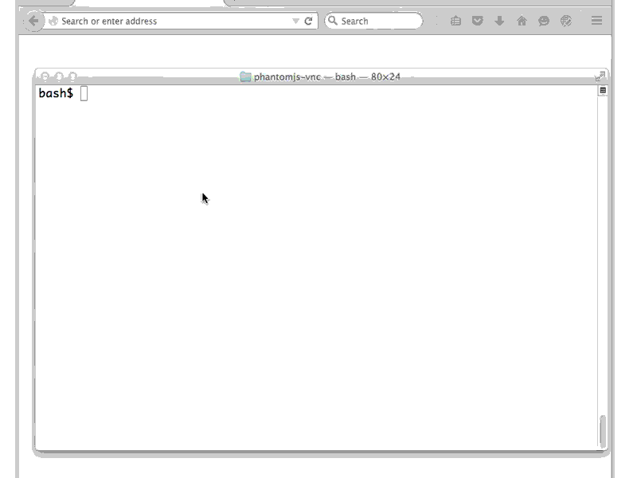

# Nearly Headless Nick - Scriptable Headless WebKit + VNC

**Nearly Headless Nick** is a fork of PhantomJS, the scriptable headless WebKit
browser, which sports a VNC head. You can use it like PhantomJS, and view
with a live rendering of the current page using an HTML5 VNC client.

This is useful while writing and debugging tests with phantomjs, or observing
the progress of automated testing.

It is based on the [QtVNC](https://github.com/pigshell/qtbase) fork which
adds VNC support to Qt 5 as a platform plugin.

## Build

The usual PhantomJS build procedure works with no modifications.

Prebuilt binaries for Mac OS and Linux can be downloaded in the
[releases page](https://github.com/pigshell/nhnick/releases).

## Usage

    phantomjs --show-page=true -platform vnc /path/to/script.js

By default, this will listen on 127.0.0.1:5900 for a websocket connection.
Navigate to http://localhost:5900 using any modern browser and you should see
a live rendering of the current page.

A minimal script.js is given below:

    var page = require('webpage').create();
    page.open('http://reddit.com', function() { /* phantom.exit() */});

Note that the call to `phantom.exit()` is omitted, otherwise `phantomjs`
might exit before you have time to connect to it.

## Options

### PhantomJS options

By default, pages are not rendered to the frame buffer and therefore not visible
via VNC, even when the VNC platform is selected. Two new methods are available
in the web page module to show and hide pages on an individual basis.

  * `page.show()` starts rendering `page` to the frame buffer, making it
    visible via VNC. It replaces the previous page, if any.
  * `page.hide()` stops rendering `page`.

The `--show-page=true` command line option automatically invokes `show()` on
all created pages. Only the latest page is visible.

### VNC options

VNC options can be supplied with the `-platform` command line option 
or the `QT_QPA_PLATFORM` environment variable. The platform string starts with
`vnc` and a combination of the following options, separated by colons.

  * `size=<width>x<height>` Width and height of the frame buffer.
    * Default: `size=800x600`
  * `display=<num>` VNC display number. Server listens to port 5900 + `<num>`
    * Default: `display=0`
  * `addr=<IP>` IPv4 address on which the server listens.
    * Example: `addr=0.0.0.0` listens on all interfaces
    * Default: `addr=127.0.0.1`
  * `mode=<str>` One of `websocket` or `raw`. Use `websocket` to connect with
    a browser-based HTML5 VNC viewer, or `raw` to use a regular VNC client like
    _vncviewer_ or _Chicken of the VNC_.
    * Default: `mode=websocket`
  * `viewer=<URL>` Sets the location of the HTML5 VNC viewer. In `websocket`
    mode, any regular HTTP request to the listening port will be issued an HTTP
    redirect to the viewer URL, appended with a hash fragment containing
    host and port parameters. Websocket requests from other origins are
    rejected. Note that the colon needs to be URL-encoded since Qt uses it as
    an option separator. Websocket requests from origins other than the viewer
    will be rejected.
    * Default: `viewer=http%3A//pigshell.github.io/noVNC/qtvnc.html`
  * `maximize=<bool>` Maximize first window. Without this option, apps which
    don't maximize themselves usually occupy a small window at the top left
    of the frame buffer.
    * Default: `maximize=true`

## Gotchas

  * Does not support authentication.
  * Does not support SSL.
  * Does not build on Windows.
  * Does not show popup windows.
  * Occasional crash under high load. I suspect it is due to [this](https://codereview.qt-project.org/#/c/110150/7).

## Future work

  * Show multiple pages in tabs.
  * Readonly mode to disallow interaction with the page.
